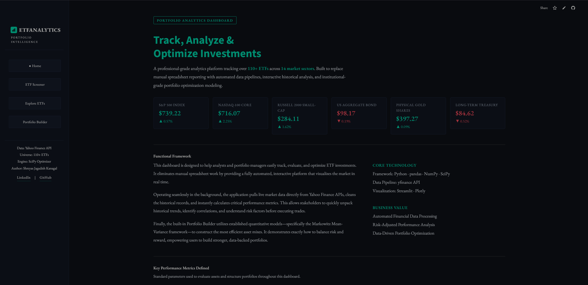
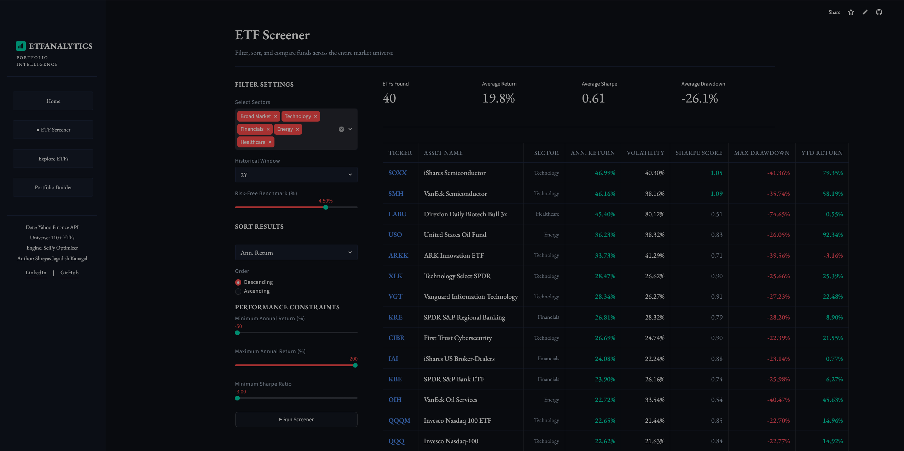
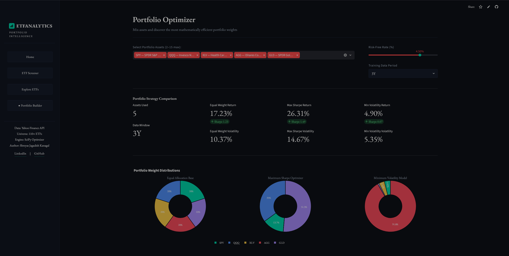
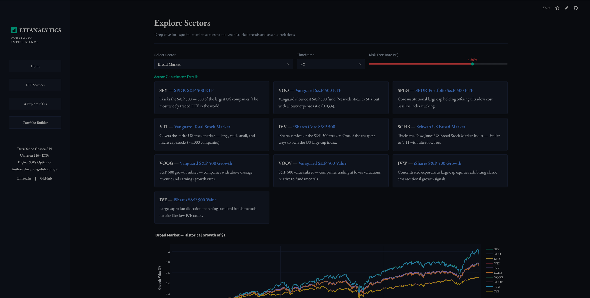

# 📊 Investment Analytics Platform

> An interactive, professional-grade ETF analytics dashboard covering **110+ ETFs** across **14 market sectors** — built with Python, Streamlit, and institutional quantitative finance models.

🔗 <a href="https://investment-analytics-platform.streamlit.app" target="_blank">Live Demo →</a> &nbsp;|&nbsp;
👤 <a href="https://www.linkedin.com/in/shreyaskanagal" target="_blank">LinkedIn</a> &nbsp;|&nbsp;
💻 <a href="https://github.com/shreyaskanagal" target="_blank">GitHub</a>

---

## 🖼️ Preview





---

## 🚀 Features

| Module | Description |
|---|---|
| **Home Dashboard** | Live market quotes for 6 benchmark ETFs (SPY, QQQ, IWM, AGG, GLD, TLT) with real-time price and daily % change |
| **ETF Screener** | Filter, sort, and rank 110+ ETFs by annualized return, volatility, Sharpe ratio, max drawdown, and YTD return |
| **Sector Explorer** | Deep-dive into 14 asset sectors — normalized price history, rolling correlation matrices, and risk/return scatter plots |
| **Portfolio Builder** | Markowitz mean-variance optimization generating Maximum Sharpe and Minimum Volatility portfolios with efficient frontier visualization |

---

## 📐 Quantitative Models

- **Annualized Return & Volatility** — Computed from daily log returns scaled to 252 trading days
- **Sharpe Ratio** — Risk-adjusted return relative to a configurable risk-free rate (default 4.5%)
- **Maximum Drawdown** — Peak-to-trough decline across the full historical window
- **Markowitz Mean-Variance Optimization** — SciPy SLSQP solver under long-only, fully-invested constraints
- **Efficient Frontier** — Monte Carlo simulation of 800 random portfolio weight distributions

---

## 🛠️ Tech Stack

```
Language:       Python 3.x
Framework:      Streamlit
Data:           yfinance (Yahoo Finance API)
Computation:    Pandas · NumPy · SciPy
Visualization:  Plotly
```

---

## ⚙️ Local Setup

```bash
# 1. Clone the repo
git clone https://github.com/shreyaskanagal/Investment_Analytics_Platform.git
cd Investment_Analytics_Platform

# 2. Create and activate a virtual environment
python -m venv .venv
.venv\Scripts\activate        # Windows
source .venv/bin/activate     # Mac/Linux

# 3. Install dependencies
pip install -r requirements.txt

# 4. Run the app
streamlit run etf_gen.py
```

The app will open at `http://localhost:8501`

---

## 📁 Project Structure

```
Investment_Analytics_Platform/
│
├── etf_gen.py          # Main application — all pages, data pipelines, and UI
├── requirements.txt    # Python dependencies
├── .gitignore          # Python + Streamlit ignores
└── README.md
```

---

## 📊 ETF Universe — 14 Sectors

| Sector | Example ETFs |
|---|---|
| Broad Market | SPY, VOO, VTI, IVV |
| Technology | QQQ, XLK, SOXX, ARKK |
| Fixed Income | AGG, BND, TLT, HYG |
| International | VEA, VWO, EFA, EEM |
| Healthcare | XLV, IBB, ARKG |
| Energy | XLE, VDE, AMLP |
| Financials | XLF, KRE, IAI |
| Real Estate | VNQ, IYR, XLRE |
| Commodities | GLD, SLV, PDBC |
| Dividends | SCHD, JEPI, VYM |
| Consumer | XLP, XLY, RTH |
| Utilities | XLU, IDU |
| ESG & Thematic | ICLN, LIT, DRIV |
| Volatility | VIXY, SVXY |

---

## 👤 Author

**Shreyas Jagadish Kanagal**
&nbsp;[LinkedIn](https://www.linkedin.com/in/shreyaskanagal) · [GitHub](https://github.com/shreyaskanagal)

---

*Data sourced from Yahoo Finance. For educational and portfolio showcase purposes only — not financial advice.*
